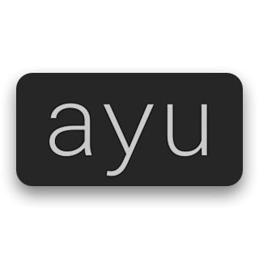
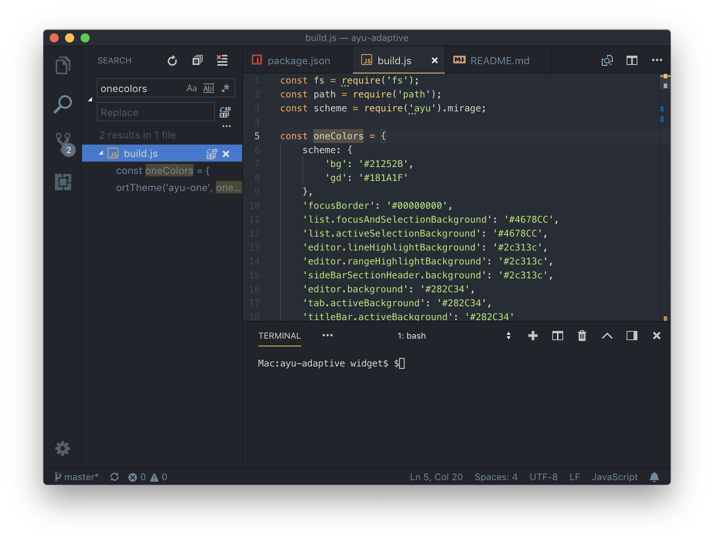
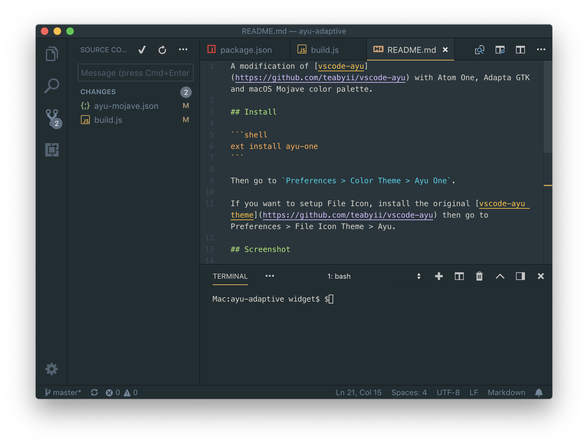
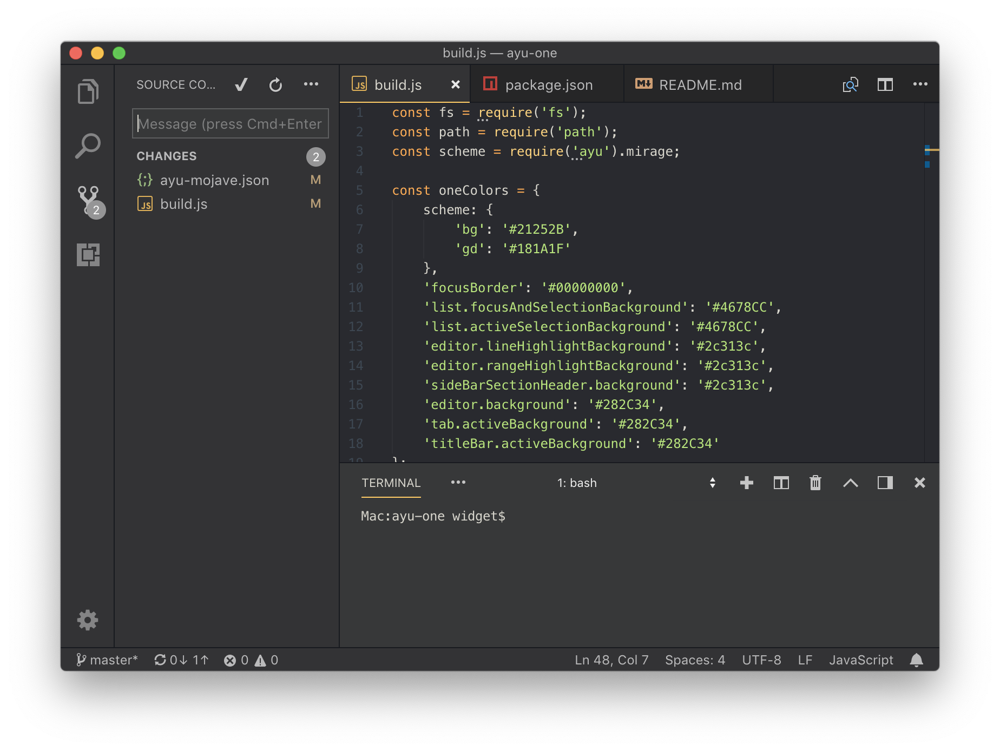

A modification of [vscode-ayu](https://marketplace.visualstudio.com/items?itemName=teabyii.ayu) with Atom One, Adapta GTK and macOS Mojave color palette.

## Install

```shell
ext install ayu-one
```

Then go to `Preferences > Color Theme > Ayu One`.

If you want to setup File Icon, install the original [vscode-ayu theme](https://marketplace.visualstudio.com/items?itemName=teabyii.ayu) then go to Preferences > File Icon Theme > Ayu.

## Screenshots

### Ayu One


### Ayu Adapta


### Ayu Mojave


## Development

Install dependencies
```shell
npm install
```

Update themes and Build VSIX package
```shell
npm run build && npm run package
```
